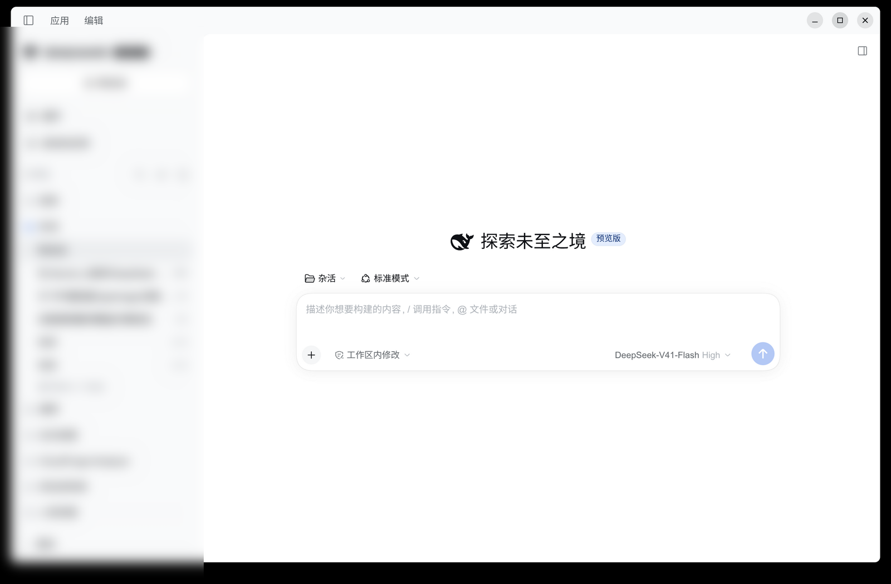

# dsh-desktop-linux

[中文](README.md) | **English**

> An independent community project. **Not** an official DeepSeek product, and not
> affiliated with DeepSeek.

Ports the **packaging pipeline** of the official
[DeepSeek Harness](https://github.com/deepseek-ai/deepseek-harness) desktop app
(the Electron application in `apps/desktop`) to Linux, producing
AppImage / deb / rpm / Arch packages.

Upstream explicitly does not support Linux today (`apps/desktop/README.md`:
*"Linux is not a supported Desktop release target."*). This project fills exactly
that gap: it teaches the official packaging pipeline about `linux-x64` and emits
installable artifacts. See [Validation status](#validation-status) for what has
actually been tested.



## What this project produces

What this project ships is **the official Electron application itself**:

- the renderer loads over its own `dsh-app://` protocol rather than connecting to a local web server;
- it carries its own Node / pnpm / Python runtime and does not use the system Node;
- it owns `$DSH_HOME/profiles/desktop` exclusively and does not touch the `web` profile.

The cost is a much heavier build: clone the upstream monorepo, run the pnpm
workspace build, then package with electron-builder.

## Install

| Distribution | Format | How |
|---|---|---|
| Any | AppImage | Download from [Releases](https://github.com/ffyfox/dsh-desktop-linux/releases), `chmod +x`, run it |
| Debian / Ubuntu | deb | `sudo apt install ./deepseek-harness-*.deb` |
| Fedora / RHEL | rpm | `sudo dnf install ./deepseek-harness-*.rpm` |
| Arch Linux | PKGBUILD | Shipped in the repo, built locally with `makepkg` (**not published to the AUR**) — see [Arch package](#arch-package) |

Artifacts are **unsigned** builds (the file name carries `-unsigned`). Once
installed, `dsh://` links are handed to it.

## Building from source

Requirements: Node 22.19+ or 24+, **pnpm 11**, and git.
Building the rpm additionally needs `rpmbuild` on the system (`rpm-tools` on Arch).

```bash
git clone https://github.com/ffyfox/dsh-desktop-linux
cd dsh-desktop-linux

./scripts/fetch-upstream.sh      # fetch upstream sources (defaults to the tag pinned in PKGBUILD)
./scripts/apply-patches.sh       # apply the patch series
./scripts/build.sh --all         # AppImage + deb + rpm
./scripts/verify.sh --runtime    # verification matrix
```

`build.sh` flags: `--dir` (unpacked directory only, fastest), `--appimage`
(default), `--deb`, `--rpm`, `--all`. The long pole is the pipeline itself
(`build:official` → `release:pack` → `prepare:*` → `package`); each extra format
only adds one fpm/AppImage packaging pass, so building formats separately is both
faster and easier to debug.

Artifacts land in
`upstream/apps/desktop/.desktop-build/targets/linux-x64/unsigned-artifacts/`.

The deb / rpm `Maintainer:` / `Homepage:` come from `upstream/apps/desktop/.env.linux`.
`build.sh` creates it on first run from the repo's `.env.linux.example`, values already filled in.
To change them, edit that file: **the same-named environment variables are filtered out by
upstream**, so `DSH_DESKTOP_LINUX_MAINTAINER=… build.sh --deb` is silently ignored.

### Hard requirement

**pnpm 11 is required.** The upstream repository declares
`packageManager: pnpm@11.7.0`, and pnpm 11 switches to that version by itself.
pnpm 9 fails `pnpm install` with `ERR_PNPM_LOCKFILE_CONFIG_MISMATCH`.

## Arch package

The PKGBUILD consumes upstream's release tarball and does not depend on the
`./upstream` checkout:

```bash
./scripts/pkgbuild-dir.sh     # flatten into ./pkgbuild
cd pkgbuild && makepkg -si
```

`pkgbuild-dir.sh` is not optional sugar: **makepkg resolves local sources by basename
inside the PKGBUILD's own directory**, so the PKGBUILD and the patches must sit
flat together. `./pkgbuild` is exactly the shape makepkg can consume.

This project is **not published to the AUR**; the PKGBUILD is for local builds only.

The Arch package installs the unpacked tree into `/opt/deepseek-harness-desktop`
and symlinks `/usr/bin/deepseek-harness` — on Arch there is no need to wrap it in
an AppImage/deb/rpm.

## How it works

```
Official Electron shell (apps/desktop)
├── renderer ──── dsh-app:// protocol ──── application UI
└── Host process ─── real Node from primary-runtime ─── bundled dsh runtime
                          └── $DSH_HOME/profiles/desktop
```

Three design points worth knowing:

- **The Host runs on a real Node, not Electron's node mode.** Under Electron's
  node mode `sharp` segfaults while decoding, so on Linux the Host uses the Node
  bundled in primary-runtime. Consequently **Linux artifacts do not put the dsh
  tree into an asar** (a real Node cannot read inside an archive), which is why
  `linux-unpacked` is large.
- **The profile is exclusive.** The desktop uses `$DSH_HOME/profiles/desktop`, and
  the CLI rejects that profile at the argument layer
  (`error: profile "desktop" is managed exclusively by the Electron application`).
  Sessions, settings, and credentials still live at the root of `$DSH_HOME`,
  shared with the CLI.
- **Sandboxing.** Where the kernel supports unprivileged user namespaces, the
  renderer runs in a namespace sandbox (separate user namespace + seccomp); only
  where it does not does it fall back to a setuid `chrome-sandbox`. The AppImage
  leaves this to AppRun's own probe, and the deb / rpm / Arch packages make the
  same decision in their postinst.

### Closing, the tray, and quitting

**Closing the window is not quitting — that is upstream's design, not a porting defect.** Upstream
`main.ts` intercepts the main window's `close` and hides it instead: the Host keeps running, tasks
are not interrupted, and session write locks are not released (one kernel flock per session, with
deliberately no expiry). So after a close, another DSH instance — a terminal `dsh web`, say — that
opens the same session gets the official message "This session is already in use, possibly by
another running DSH instance … Quit other running DSH instances and try again."

Upstream provides two ways back to a hidden window, but what its documentation covers is the Windows
tray and the macOS Dock; **Linux had neither.** Patch `0013` adds the tray: the icon stays for the
whole run, its menu holds "Open" and "Quit", and quitting goes through the same confirmation as the
menu `Quit` and `Ctrl+Q` (it asks first when the Host has running or scheduled tasks). The first
close shows a one-time native confirmation, as on Windows; once confirmed it writes the
`background-close-confirmed` marker and never asks again.

- To really quit: the tray menu's "Quit", the `Application` → `Quit` menu item, or `Ctrl+Q`.
- To get the window back: launch the application again (a second launch only focuses the instance
  that is already running).

## Validation status

**There is only a single tested environment so far, and we intend to widen that coverage.**
Both tables below are kept up to date as reports come in — please tell us how it goes in
[Issues](https://github.com/ffyfox/dsh-desktop-linux/issues), whether it works or not.

### Environment

| Environment | Status |
|---|---|
| Arch Linux · KDE Plasma 6 · Wayland · x86_64 | **Tested**, works (including the tray: the StatusNotifierItem registers, its menu holds Open and Quit, and quitting from that menu releases the process, the port, and the session write locks together) |
| X11 (any distribution / desktop) | Not tested |
| Other desktops (GNOME, Hyprland, …) | Not tested |
| Debian / Ubuntu, Fedora / RHEL | Not tested |
| aarch64 | Not built, not tested |

### Artifacts

| Artifact | Status |
|---|---|
| Arch package | **Tested**: `makepkg` → `pacman -U` → launch, sandbox, uninstall |
| AppImage | **Tested**: built and launched |
| `linux-unpacked` | **Tested**: `verify.sh --runtime` live matrix |
| deb | Control fields checked only — never installed or run on Debian / Ubuntu |
| rpm | `rpm -qip` fields checked only — never installed or run on Fedora / RHEL |

## Known limitations

- **GNOME shows no tray by default.** The tray uses freedesktop StatusNotifierItem, which GNOME
  displays only with `gnome-shell-extension-appindicator` installed. Without a tray host the icon
  never appears, and a hidden window can then only be recovered by launching the application again
  — the old "silently running in the background" trap comes back.
- **Electron is newer than the version upstream's lockfile pins (44.4.5).** Upstream's
  `apps/desktop/package.json` says `^44.0.0`, which the caret already allows, but its lockfile pins
  the resolution to 44.0.0 — and that version's **tray item registers on neither KDE nor GNOME**
  (upstream regression [electron#53213](https://github.com/electron/electron/issues/53213), fixed by
  [electron#53214](https://github.com/electron/electron/pull/53214) only on 2026-08-26, while 44.0.0
  was released on 08-25). Patch `0014` resolves the lockfile to 44.4.5; the cost is that Linux
  artifacts carry a slightly newer Chromium than upstream's desktop releases.
- **No auto-update.** Upstream's mandatory-update policy channel only recognises
  `desktop-win` / `desktop-mac` client identities, and Linux artifacts carry no
  update channel, so the Linux build embeds no policy, never polls, and never
  updates itself.
- **Unsigned.** Artifacts are unsigned builds.
- **Platform sees a Linux client as macOS.** Upstream maps client identity with
  `platform === 'win32' ? 'desktop-win' : 'desktop-mac'`, so Linux lands on
  `desktop-mac`. That follows from upstream's `'darwin' | 'win32' | null` union
  and is not introduced here; the same request reports `device_model` as
  `linux-x64`.
- **`linux-unpacked` is about 1.1G.** With asar disabled it is a tree of small
  files; the AppImage compresses it to 339M, but first launch reads more files
  than an asar build would.
- **x86_64 only.**

## License

MIT
